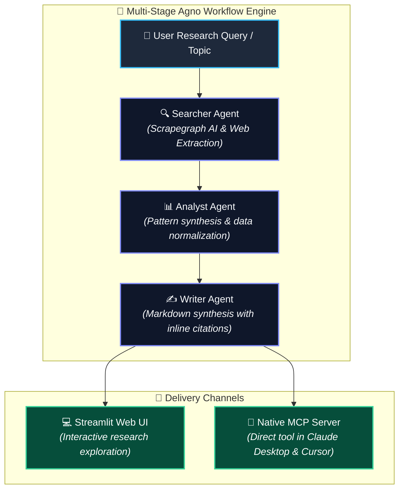

# Deep Researcher Agent & MCP Server 🔍🧠

[](https://www.python.org/downloads/)
[](https://www.agno.com/)
[](https://modelcontextprotocol.io/)
[](https://streamlit.io)
[](LICENSE)
[](https://github.com/blue007-arc)

An autonomous multi-stage AI research workflow agent that searches the web, analyzes unstructured data, and compiles publication-quality technical reports. Features both a **Streamlit Web UI** and a native **Model Context Protocol (MCP) server** for integration with Claude Desktop and Cursor.

Developed and maintained by **[Sakshi Pandey](https://github.com/blue007-arc)** (`231FA04H01@gmail.com`).

---

## 🏗️ Multi-Stage Pipeline Workflow



---

## 🌟 Key Features

- **🔄 Multi-Stage Orchestration**: Dedicated sub-agents (Searcher, Analyst, Writer) collaborate sequentially to produce exhaustive, cited research reports.
- **🌐 AI-Assisted Scraping**: Extracts data from live web pages using Scrapegraph AI and Nebius AI models.
- **🔌 Native MCP Server**: Exposes the deep research pipeline as an MCP tool directly accessible inside **Claude Desktop**, **Cursor**, or any MCP-compatible client.
- **💻 Multiple Interfaces**: Run research workflows via Streamlit web app, direct command line script, or through the background MCP server.

---

## 🛠️ Tech Stack

- **Agent Orchestrator**: [Agno](https://www.agno.com/)
- **Inference Provider**: [Nebius Token Factory](https://tokenfactory.nebius.com) (Qwen / Llama models)
- **Web Extraction**: [Scrapegraph AI](https://scrapegraphai.com/)
- **Protocol**: [Model Context Protocol (MCP)](https://modelcontextprotocol.io/)
- **UI & Visualization**: [Streamlit](https://streamlit.io/)

---

## 📁 Repository Structure

```text
deep-researcher-agent-mcp/
├── app.py                  # Streamlit web interface
├── agents.py               # Core multi-stage agent pipeline (Searcher, Analyst, Writer)
├── server.py               # Native Model Context Protocol (MCP) server
├── assets/                 # Architecture graphics and demo assets
├── pyproject.toml          # uv / pip dependency specifications
├── .env.example            # API key template
├── .gitignore              # Git ignore rules
└── LICENSE                 # MIT License
```

---

## ⚡ Quick Start

### 1. Prerequisites
- Python 3.10 or higher
- [uv](https://github.com/astral-sh/uv) (recommended) or `pip`
- [Nebius Token Factory](https://tokenfactory.nebius.com) API Key
- [Scrapegraph AI](https://scrapegraphai.com/) API Key

### 2. Installation

```bash
# Clone the repository
git clone https://github.com/blue007-arc/deep-researcher-agent-mcp.git
cd deep-researcher-agent-mcp

# Install dependencies with uv
uv sync
```

### 3. Environment Setup

```bash
cp .env.example .env
```

Add your API keys to `.env`:
```env
NEBIUS_API_KEY=your_nebius_api_key_here
SGAI_API_KEY=your_scrapegraph_api_key_here
```

---

## 💻 Running the Agent

### Option 1: Web Interface (Streamlit)
```bash
uv run streamlit run app.py
```
Open `http://localhost:8501` in your browser. Enter any topic (e.g. *"State of Autonomous Coding Agents in 2025"*) and watch the multi-stage research flow stream in real-time.

### Option 2: Command Line
```bash
uv run python agents.py
```

### Option 3: Connect to Claude Desktop or Cursor (MCP)
Add the server configuration to your `claude_desktop_config.json` or `.cursor/mcp.json`:

```json
{
  "mcpServers": {
    "deep_researcher": {
      "command": "python",
      "args": [
        "run",
        "server.py"
      ],
      "env": {
        "NEBIUS_API_KEY": "your_nebius_api_key_here",
        "SGAI_API_KEY": "your_scrapegraph_api_key_here"
      }
    }
  }
}
```

---

## 👤 Author & Maintainer

**Sakshi Pandey**
- GitHub: [@blue007-arc](https://github.com/blue007-arc)
- Email: [231FA04H01@gmail.com](mailto:231FA04H01@gmail.com)

---

## 📄 License
This project is licensed under the MIT License - see the [LICENSE](LICENSE) file for details.
